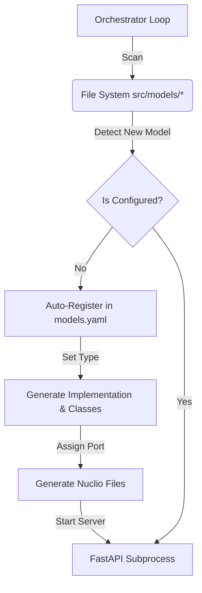
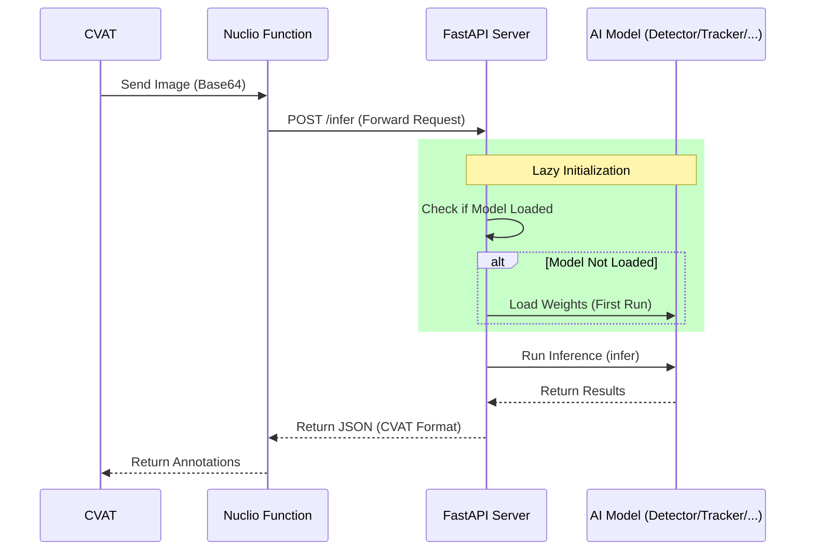

# CVAT Custom Model Orchestrator

Enterprise-level CVAT/Nuclio integration platform with FastAPI. Supports multiple model types (Detector, Tracker, Interactor) with ultra-high performance, dynamic scalability, and zero-config automation.

## Features

- **Multi-Model Type Support**: Handle **Detectors**, **Trackers**, and **Interactors** through a unified interface.
- **Multi-Instance Support**: Run the same model implementation with different weights or configurations simultaneously.
- **Generic Configuration**: Pass any custom parameters to models via the `config` block in `models.yaml`.
- **Auto-Detection & Generation**: New models are detected automatically. If implementation files or `classes.txt` are missing, they are generated using intelligent templates.
- **Auto-Configuration**: Model types and ports are automatically managed in `config/models.yaml`.
- **Nuclio Generator**: Dynamic deployment files for CVAT are automatically generated with type-specific annotations and specs.
- **Lazy Initialization**: Models load only when requested, with no overhead during server startup.
- **Smart Resource Management**: Automatic memory unloading for idle models.
- **Enterprise Architecture**: Fully typed, PEP8 compliant, and designed for production extensibility.

## Software Flow

### 1. Initialization & Orchestration
The **Orchestrator** (`src/services/orchestrator.py`) is the centralized controller. It monitors the environment and ensures the system state matches the configuration.



### 2. Request Flow (CVAT -> Nuclio -> FastAPI)
Data flows through the generated Nuclio function to the dedicated model server.



## Project Structure

```
yolov12-backend-fastapi/
├── src/                    # Main source directory
│   ├── core/              # interfaces, config, exceptions
│   ├── services/          # orchestrator, model loader, runner
│   ├── models/            # Model implementations (Detector/Tracker/Interactor)
│   └── api/               # FastAPI application logic
├── config/                # Configuration
│   ├── models.yaml        # Central model registry (Auto-updated)
│   └── cvat/             # Generic Nuclio template (template.yaml)
├── nuclio_functions/      # Generated Nuclio deployment packages
├── scripts/              # Utility scripts
├── main.py              # System Entry Point
├── pyproject.toml       # Project configuration and dependencies
└── uv.lock              # Lockfile for reproducible environments
```

## Management Script

For convenience, a `docker-compose` style management script is provided:

```bash
# Start in foreground
./orchestrator.sh up

# Start in background (detached)
./orchestrator.sh up -d

# Stop the system
./orchestrator.sh down

# Check status
./orchestrator.sh status

# View logs
./orchestrator.sh logs -f
```

## Quick Start (Alternative)
If you prefer running directly:
1. `uv sync`
2. `uv run python main.py`

## Configuration & Multi-Instance
Settings are managed in `config/models.yaml`. The orchestrator automatically registers new models found in `src/models/` and assigns them a unique port.

### Multi-Instance & Custom Weights
You can define multiple instances of the same model implementation with different configurations:

```yaml
models:
  yolov12n_v1:
    implementation: "yolov12n"
    port: 5001
    config:
      weights: "path/to/weights1.pt"
  yolov12n_v2:
    implementation: "yolov12n"
    port: 5002
    config:
      weights: "path/to/weights2.pt"
      confidence_threshold: 0.5
      device: 'cuda:0'
    classes: ["person", "car", "truck"]
    interpreter_path: "/path/to/specific/venv/bin/python"
```

Any field inside the `config` dictionary is passed as a keyword argument to the model's `__init__` method. The `interpreter_path` field allows running the model instance in a different Python environment (e.g., with specific CUDA or library versions).

## Development & Testing

### Installation
```bash
# Clone the repository and install dependencies
uv sync
```

### Running Tests
The project uses `pytest` for automated testing.
```bash
uv run pytest tests/
```
See [tests/README.md](./tests/README.md) for more details.

### Code Style
This project follows PEP8 standards. Comprehensive docstrings are provided for all core modules.

## License
MIT License
